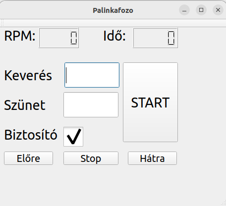
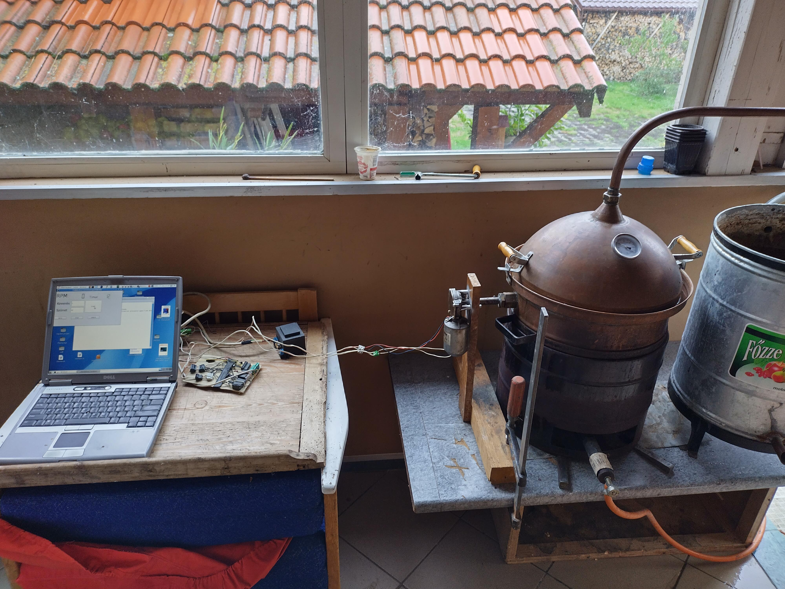

## Smart mixer for brandy maker machines("pálinkafőző" in hungarian).
The fermented fruit must be mixed in every few minutes for a few seconds. So the operator had to stay around the machine and do it manually. I automated this process so the operator can go away from the machine and do something else.\
A simple timer without feedback is not enough because sometimes little seeds or fruit practicles bloks the mixer. This scenario must be detected and the mixed should be spinned backwards for a few seconds to unblock it.\
If it is unsuccessful then a loud warning sound is played to notify the operator about the issue.\
The machine is operated by a 24V DC engine with a revolution counter. It is connected to a PC with a parallel port. The parallel port pins can be controled and read with parapin library.\
The operator must set mix time in seconds(Keverés) and break time in seconds(Szünet) and press START. Then the machine starts mixing until mix time lasts then wait until break time lasts then repeat the cycle until STOP or other control buttons are pressed.\
There is a Forward(Előre) and a Backward(Hárta) button which spins the mixer in the given direction continiously untill STOP ot the other direction is pressed.\
The engine's revolution(RPM) and cycle time(Idő) displayed. Cycle time is consist of mix time plus break time.\
If the mixer is starting to get blocked the revolution of the DC engine will dropp. This is detected by the software and it will try to spin the mixer backwards as a human operator would do. This action unblocks the mixer most of the cases.\
If the unblock attempt is successful then we return to normal mode of operation.\
If the unblock attempt is unsuccessful the RPM is marked with red and loud warning siren is played.\
This safety mechanism can be removed via removing the check from "Biztosító". In this case the software do not care about the engine's revolution and never start the unblock process. This is strongly not recommended however there is one scenario when it can be useful. When the revolution counter become faulty and we still want to use machine to finish the already started destillation process.\

